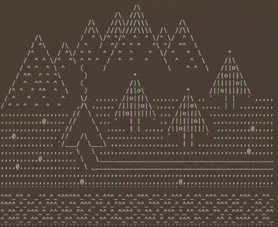

# 🏕️Lodge

**Lodge** is a library currently made only for **Debian/Ubuntu**. 
Its main purpose is to give a rest to a user (probably after many hours of coding)

## 👀 Features

Press `lodge` to take a rest in a lodge (if you are a tired wanderer, of course).

## 🖥️ Installation

To be able to take rest immediately just follow [INSTALLATION.md](INSTALLATION.md)

## 👋 Contributing

If you're a developer, you can make a direct impact by contributing code. Clone the repository, make your changes, and
submit a pull request.

Not a developer? No problem! You can still contribute by creating issues, reporting bugs, or suggesting new ideas for
project improvement (do this via GitHub Issues). Your insights and feedback are invaluable to our collective success and
helps us to create a better place for taking rest.

Thank you for your contribution and support to the project!